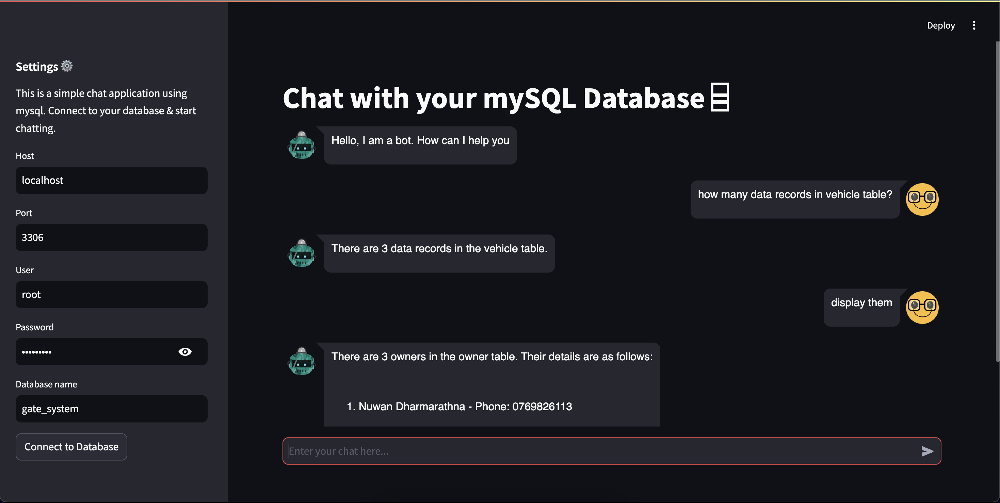

# MySQL Chatbot with OpenAI API and LangChain



## Overview

This project features a chatbot that leverages OpenAI’s API and LangChain to interact with a MySQL database. Users can connect to a local database through a Streamlit dashboard and engage with the database using natural language queries. The chatbot also supports accessing and displaying `chat_history` for continuous and context-aware conversations.

## Features

- **Connect to Local MySQL Database**: Input database credentials in the Streamlit dashboard to establish a connection.
- **Natural Language Queries**: Use the chatbot to issue queries to the database in natural language.
- **Access Chat History**: The chatbot maintains and displays a history of interactions, allowing users to review previous queries and responses.
- **Streamlit Dashboard**: Intuitive web interface for user interaction and database connection setup.

## Installation

1. Clone the repository:

   ```bash
   git clone https://github.com/nuwan-dharmarathna/chat-with-mysql-data
   cd chat-with-mysql-data
    ```
2. Install the required packages:

    ```bash
    pip install -r requirements.txt
    ```
## Usage

1. Ensure you have an OpenAI API key and set it up in your environment variables.

2. Run the Streamlit app:
    ```bash
    streamlit run main.py
    ```
3. Connect to the Database:

    -Enter your MySQL database details (host, port, username, password, database name) in the provided fields.
    -Click "Connect" to establish a connection to the local database.

4. Chat with the Database:

    -Type your question into the chatbot interface.
    -Receive responses generated based on the data in your MySQL database.
    -View Chat History: The chatbot maintains a history of your interactions. Access previous queries and responses -directly within the chat interface to track and revisit past conversations.

## Requirements

The project dependencies are listed in the `requirements.txt` file. Ensure all packages are installed to guarantee the chatbot functions correctly.

## Contributing

Feel free to contribute to this project by submitting issues or pull requests. For major changes, please open an issue first to discuss what you would like to change.

## References

- **alejandro-ao.com**: https://alejandro-ao.com/chat-with-mysql-using-python-and-langchain/


